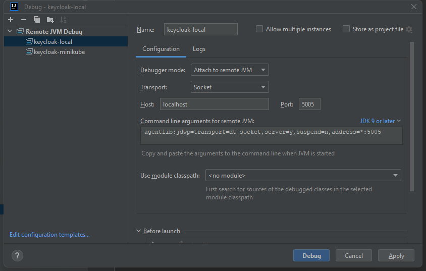

# Local Development Environment Setup

To set up a remote JVM debug environment for Keycloak using Docker, you can launch Keycloak via Docker Compose, expose the remote debug port, and use IntelliJ's "Remote JVM Debug" configuration to connect to the running container. This allows you to place breakpoints in the IntelliJ IDE and debug Keycloak in real-time.

### Steps:
1. **Launch Keycloak with Docker Compose**: Ensure the `docker-compose.yml` file is configured to export port `5005` (or your desired debug port) for remote debugging. This can be done by adding the following line under the Keycloak service definition in your `docker-compose.yml`:

   ```yaml
   ports:
     - "5005:5005"
   ```

2. **Start the Keycloak container**: When you start the container, Keycloak will pause at the debug listening state with a message similar to:  
   `Listening for transport dt_socket at address: 5005`.  
   This indicates that the JVM is waiting for a debugger to attach to port `5005`.

3. **Configure IntelliJ for Remote Debugging**:
    - In IntelliJ, go to **Run** > **Edit Configurations**.
    - Click the **+** icon and select **Remote JVM Debug**.
    - Set the **Host** to `localhost` (or the IP of your Docker host) and **Port** to `5005` (or the port you’ve exposed).
    - Apply the configuration.

4. **Attach the Debugger**: With the Keycloak container waiting for a debugger to connect, start your IntelliJ **Remote JVM Debug** configuration. IntelliJ will attach to the Keycloak JVM running inside the Docker container.

5. **Set Breakpoints and Debug**: Once connected, you can set breakpoints in the Keycloak source code, and IntelliJ will stop execution at those points, allowing you to step through the code, inspect variables, and debug the runtime behavior of Keycloak.

6. **Resume Keycloak Startup**: After attaching the debugger, the Keycloak container will proceed with its startup process, allowing you to continue debugging as needed.

By following these steps, you can effectively debug the Keycloak source code while it's running in a Docker container, using IntelliJ to step through code and track the application’s behavior at runtime.

### Docker Containers
Two Docker containers will be started to set up the Keycloak local debug environment: one for MySQL and another for Keycloak. Both containers will be on the same Docker network, allowing them to communicate with each other. The Keycloak container depends on the MySQL container, as its backend database is configured to use MySQL.

**docker-compose.yml**
```yaml
# The networks the Docker container will be part of. In Docker Compose, containers can be connected to different networks, allowing them to communicate with each other.
networks:
# The name of the network. It signifies that the Docker container should be connected to a network named "database."
  database:
# This key indicates that the network named "database" is an external network, meaning it has already been created outside of the current docker-compose.yaml file. Docker Compose will not create this network but will instead connect the container to an existing one.
    external: true

services:
  keycloak:
      build:
        context: .
        dockerfile: Dockerfile
      environment:
        KEYCLOAK_ADMIN: admin
        KEYCLOAK_ADMIN_PASSWORD: admin
        KC_HTTP_ENABLED: true
        KC_HTTP_PORT: 8080
        KC_HOSTNAME_STRICT: false
        KC_HOSTNAME_STRICT_HTTPS: false
        DEBUG: 'true'
        DEBUG_SUSPEND: 'y'
        DEBUG_PORT: '*:5005'
      volumes:
        - ./volumes/keycloak/conf:/opt/keycloak/conf
        - ./volumes/keycloak/providers:/opt/keycloak/providers
      ports:
# maps port 8080 inside the Docker container (where Keycloak runs its default web server) to port 80 on the host machine. 
# As a result, Keycloak will be accessible on http://localhost:80 or http://<your-docker-host-ip>:80.
# This is especially useful when the authorization callback domain must consist of only the domain name, without any protocol prefix, port number, or path suffix.
        - 80:8080
# maps port 5005 inside the Docker container to port 5005 on the host machine
# This is typically used for remote JVM debugging. Port 5005 is the default port for Java Debug Wire Protocol (JDWP) connections.
# It allows you to connect to the JVM running inside the container from an IDE like IntelliJ or Eclipse for debugging purposes.
        - 5005:5005
      command:
        - start-dev
      networks:
        - database
```

**docker-compose-mysql.yml**
```yaml
networks:
  database:
    external: true

services:
  whereq-mysql:
    image: mysql:8.0.32
    volumes:
      - ./config/mysql:/etc/mysql/conf.d
      - /c/Users/googo/docker/volumes/mysql/mysql-files:/var/lib/mysql-files
      - /c/Users/googo/docker/volumes/mysql/log:/var/log/mysql
      - /c/Users/googo/docker/volumes/mysql/data:/var/lib/mysql
    environment:
      - MYSQL_ALLOW_EMPTY_PASSWORD=yes
      - MYSQL_DATABASE=whereq
      - MYSQL_ROOT_PASSWORD=123456
    # If you want to expose these ports outside your dev PC,
    # remove the "127.0.0.1:" prefix
    networks:
      - database
    ports:
      - 3306:3306
    command: mysqld --character_set_server=utf8mb4 --explicit_defaults_for_timestamp
```

### Scenario Explain:

In this scenario, there is another `docker-compose-mysql.yaml` file (or a previously created Docker container) that has started a MySQL container and created a network called "database."

By specifying `external: true` for the "database" network:

-   The current container (defined in this Docker Compose file) will be able to connect to the MySQL container (running in the pre-started container) because both containers are part of the same "database" network.
-   Since they are on the same network, they can communicate with each other using container names (such as `mysql` or any other service name) as hostnames without exposing ports publicly on the host machine.

This setup is common in multi-container applications where services (like databases) need to be accessible by other containers within the same network.


|  |
|---------------------------------------------| 
| Remote JVM Debug |